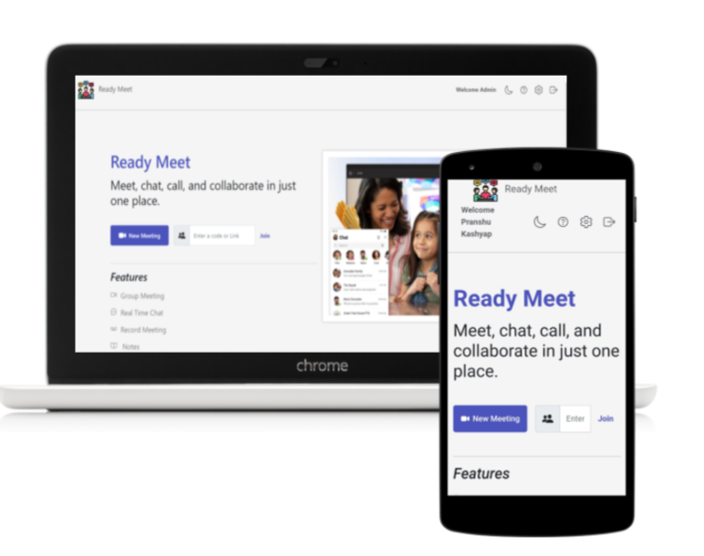
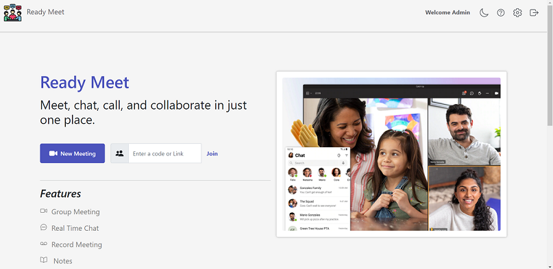
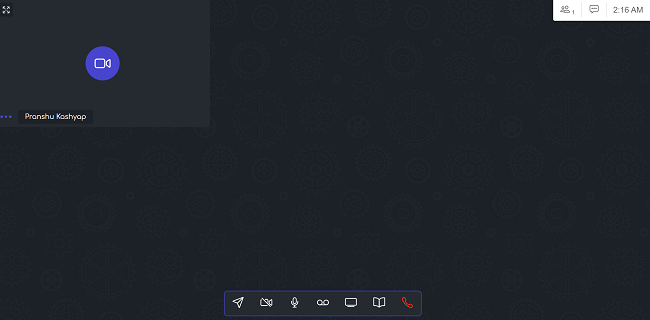
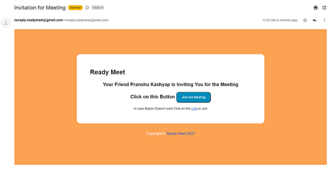

# 🎥 Ready-Meet

  

Ready Meet is a Group Video Meeting and Chat Web Application, where multiple users can connect for Video Meetings can do real-time Chat.

> #### List of Features it currently Supports includes : 

* 📹 Group Video Meeting 
* 💬 Real-Time Chat Support
* ➿ Record the Meeting for the User 
* 📝 Take Meeting Notes and Download as PDF 
* 📧 Send Email Invitation 
* 🌙 Home Page Supports Dark Mode
* 🔎 Zoom User Windows for better Visiblity 
* 👤 User Authenticaion

> ## Documentation
- [Demo video](https://youtu.be/BK7v-Gz2EUg)
- [Presentation](https://docs.google.com/presentation/d/1z6csQ5YHbrYu9RsSbmHp7JdDms3Ntkd4fReq6RBJtD0/edit?usp=sharing)

> ## Table of Content 

* [Deployment](#deployment)
* [Tools and Technologies Used](#tools-and-technologies-used)
* [Usage](#usage)
* [Local Setup](#local-setup)
* [Improvements](#improvements)
* [License](#license)
* [Screenshots](#screenshots)

> ## Deployment 

Deployed Website (on Heroku): https://readymeet.herokuapp.com/
* Server is deployed to Heroku
* MongoDB is deployed to MongoAtlas

> ## Tools and Technologies Used
* EJS, CSS/Bootrap and Javascript is Used for Frontend
* Nodejs Express as Backend and MongoDB for Database
* WebRTC and peerjs for Video Meeting 
* Socket.io for ChatBox
* Passport.js for Authentication
* jsPDF for Downloading Notes as PDF and SweetAlert for alerts

> ## Usage
* For Using Ready Meet user need to first Signup and Create new Account and Login to the Account. 
* Start the Meeting or Join New Meeting using Meeting Link, make sure to paste only uuid for join meet option. 
* Users Enters the Waiting Room for the First Time. Here he's in listen only mode i.e, Chats, Video, Audio, Screen Share options are not visible to other people in meeting. 
* For Email Invitation type the Email Adress of user, for multiple invitation type emails seperated by commas, and click Send Invitation.
* The Recoding Video Downloaded is in mkv format is not supported by Windows Media Player. So Make Sure to open it using **[VLC Media Player](https://www.videolan.org/)**. 
* User Can Turn on/off his Video/Audio. Also, the user window can be zoomed for better visiblity. 
* Take down Notes and download it as a PDF for future reference of the Meeting.
* Chat with Other during the Meeting. 

> ## Local Setup
Pre-Requisites: You must have Nodejs installed locally on your system
* Clone the Repository `git clone https://github.com/pranshukas/Ready-Meet.git` or directly download the zip file.
* ` cd Ready-Meet/`
* Intall the Dependencies `npm install`
* _Optional_ Install Nodemon `npm install -g nodemon`
* Starting the App `npm start` or `node server.js`
* Open `http://localhost:3000/` to view the App

> ## Improvements

* The Project has various rooms for improvements from scaling Application to adding new Features like Users are able to chat before as well after Meetings, able to create teams and add Participants, share resources. 
* __Biggest Issue that I found was send email invitation from Client Side has Token ID visible to world which is prone to Vulnerabilities, issue can be solved by using server side email invitation sending.__
* Currently the Website is not Scaled due to which there is latency in loading and API Calls. During meeting if any user leaves the meeting, his meeting Window closes after few sec due to latency in API calls. 
* Also, the User is able to record only his video not entire meeting. In future User can record the entire meeting. 
* Also, the User Count is having some bugs, it decreases to -1 on page refresh or shows wrong output when multiple users enters/leaves meeting which needs to be fixed. 

😃 Suggestions and Contibutions are Welcomed! Feel free to Reach out to me! **[Pranshu Kashyap](https://github.com/pranshukas)**

> ## License
MIT License

Copyright (c) 2021 Pranshu Kashyap

Permission is hereby granted, free of charge, to any person obtaining a copy
of this software and associated documentation files (the "Software"), to deal
in the Software without restriction, including without limitation the rights
to use, copy, modify, merge, publish, distribute, sublicense, and/or sell
copies of the Software, and to permit persons to whom the Software is
furnished to do so, subject to the following conditions:

The above copyright notice and this permission notice shall be included in all
copies or substantial portions of the Software.

THE SOFTWARE IS PROVIDED "AS IS", WITHOUT WARRANTY OF ANY KIND, EXPRESS OR
IMPLIED, INCLUDING BUT NOT LIMITED TO THE WARRANTIES OF MERCHANTABILITY,
FITNESS FOR A PARTICULAR PURPOSE AND NONINFRINGEMENT. IN NO EVENT SHALL THE
AUTHORS OR COPYRIGHT HOLDERS BE LIABLE FOR ANY CLAIM, DAMAGES OR OTHER
LIABILITY, WHETHER IN AN ACTION OF CONTRACT, TORT OR OTHERWISE, ARISING FROM,
OUT OF OR IN CONNECTION WITH THE SOFTWARE OR THE USE OR OTHER DEALINGS IN THE
SOFTWARE.

> ## Screenshots 

